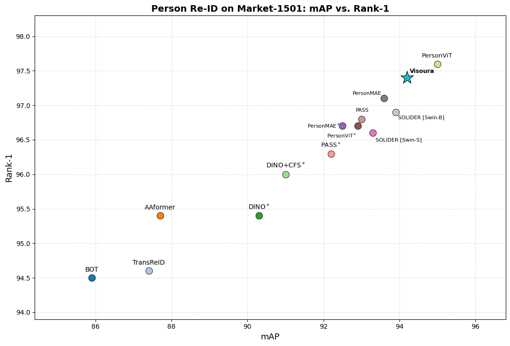
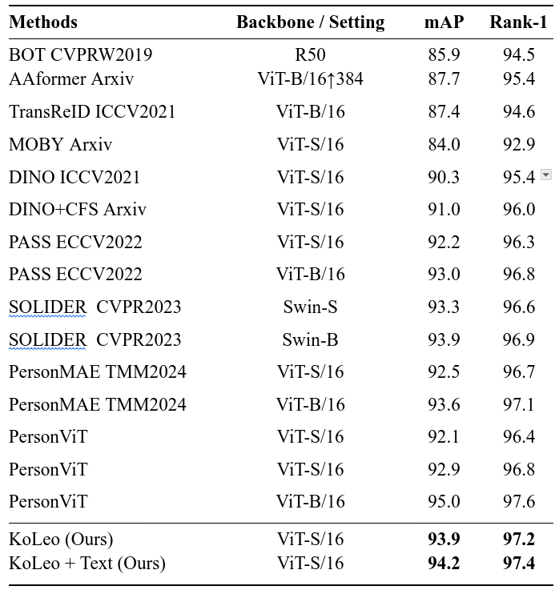

# VisouraReID
VisouraReID: Modular Supervision for Person Re-Identification

## Contributions
## Results


## Download
You can download person ReID supervised-trained model and log from [reid_ft_model_logs](https://huggingface.co/David-Magdy/VisouraReID)

## ReID Fine-tuning and  Evaluating
first download the pretrained models from [ViT-S/16](https://huggingface.co/lakeAGI/PersonViT/tree/main/vits.lup.256x128.wopt.csk.4-8.ar.375.n8) and save it to pretrained
```shell
cd transreid_pytorch
sh run_epochs.sh ../pretrained/vits.lup.256x128.wopt.csk.4-8.ar.375.n8/ vits.lup.256x128.wopt.csk.4-8.ar.375.n8 220 0 2 small
```
